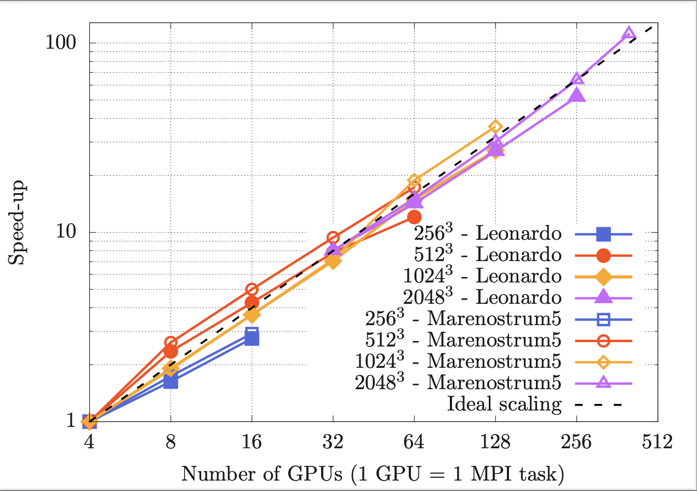
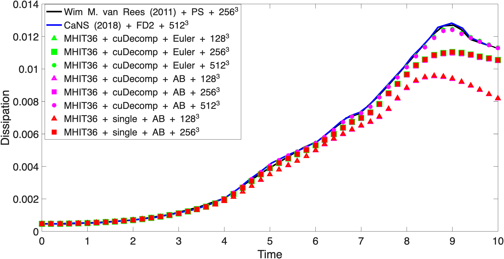

# MHIT36_cuDecomp

~~~text
███    ███ ██   ██ ██ ████████ ██████   ██████           ██████ ██    ██ ██████  ███████  ██████  ██████  ███    ███ ██████  
████  ████ ██   ██ ██    ██         ██ ██               ██      ██    ██ ██   ██ ██      ██      ██    ██ ████  ████ ██   ██ 
██ ████ ██ ███████ ██    ██     █████  ███████    +     ██      ██    ██ ██   ██ █████   ██      ██    ██ ██ ████ ██ ██████  
██  ██  ██ ██   ██ ██    ██         ██ ██    ██         ██      ██    ██ ██   ██ ██      ██      ██    ██ ██  ██  ██ ██      
██      ██ ██   ██ ██    ██    ██████   ██████           ██████  ██████  ██████  ███████  ██████  ██████  ██      ██ ██      
~~~

Porting of MHIT36 to multi-GPU using cuDecomp.

# Multi-GPU version status

- Poisson solver (transposition + halo update) ✅
- Poisson solver validation (periodic solutions) ✅
- Read input files ✅
- Skeleton of the code  ✅
- Halo updates test with CUDA ✅
- Poisson solver scaling ✅
- Halo updates test with host_data use_device ✅
- Flow field initialization ✅
- Phase-field initialization ✅
- Projection step implemented ✅
- Validation of projection step ✅ (implemented, not validated)
- Correction step ✅ (implemented, not validated)
- Forcing ✅
- HIT validation ❌
- Drop oscillation validation ❌
- Full code scaling ✅
- MPI writing (no halo)  ✅
- MPI reading (no halo) (to be tested)
- Serial reading (to avoid issue with Leonardo) ❌
- Courant number check (MPI reduction) ✅ !only from rank 0? enough?
- MPI I/O with different configurations (color by rank), exstensive check fo this part. ✅
- Move from Euler to AB2 as in MHIT36  ✅
- Acceleration of some parts (not done at the moment to debug the solver) ✅
- Check divergence of the fields ✅
- Courant number via MPI reduction ✅
- Umax via MPI reduction ✅
- Surface tension forces ❌
- Remove mean flow via all reduce ✅

# Run the code

- Compile first the cuDecomp library using *_lib.sh, the resulting modules and library will be located in cuDecomp/build/lib and cuDecomp/build/include
- Double check cuDecomp building is fine (must be compiled using HPC-SDK)
- Single folder: contains the single GPU version of the code (see MHIT36 repository for further details), no MPI required.
- Multi folder: multi GPU version of the code (work in progress). Use local.sh or leo.sh to compile and run the code (see porting status above); the multi GPU version relies on cuDecomp for Pencil Transposition and halo exchanges.
- Autotuning of the multi-GPU version: leave pr=0 and pc=0, cuDecomp will perform an autotuning at the start finding the best decomposition (the only input is the total number of tasks). Everything should be automatic in the code (as it is obtained from cuDecomp variable)

# Reference performance

Performance (NS only)
* 128 x 128 x 128 | 2 x RTX5000@milton |   14 ms/timestep
* 256 x 256 x 256 | 2 x RTX5000@milton |  129 ms/timestep
* 128 x 128 x 128 | 4 x A100@Leonardo  |    7 ms/timestep
* 256 x 256 x 256 | 4 x A100@Leonardo  |   44 ms/timestep
* 512 x 512 x 512 | 4 x A100@Leonardo  |  470 ms/timestep
* 512 x 512 x 512 | 8 x A100@Leonardo  |  200 ms/timestep
* 512 x 512 x 512 | 8 x A100@Leonardo  |  200 ms/timestep
* 1024 x 1024 x 1024 | 64 x A100@Leonardo | 272 ms/timestep
* 2048 x 2048 x 2048 | 256 x A100@Leonardo | 740 ms/timestep

Max resolution tested (Poisson only):
*  768 x  768 x  768 | 2 x RTX5000@milton - 16 GB VRAM
* 2048 x 2048 x 2048 | 32 x A100@Leonardo - 64 GB VRAm (also tested on 128/256 GPUs)

# Scaling

Strong scaling results obtained on Leonardo (4 x A100 64 GB x node)
* Tested from 1 node up to 64 nodes
* Grid from 64 x 64 x 64 up to 2048 x 2048 x 2048

# Validation

Benchamrk present in "W.M.VanRees,A.Leonard,D.Pullin,P.Koumoutsakos,Acomparisonofvortexandpseudo-spectralmethodsforthesimulationofperiodicvortical
flowsathighReynoldsnumbers,J.Comput.Phys.230(8)(2011)2794–2805" and also Used in CaNS.

Time evolution of the viscous dissipation:

